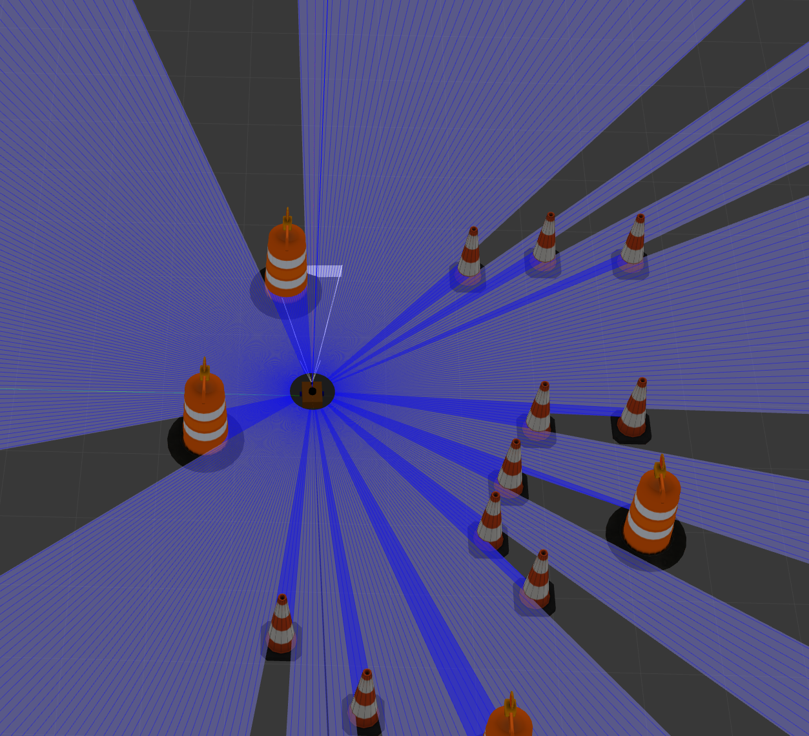
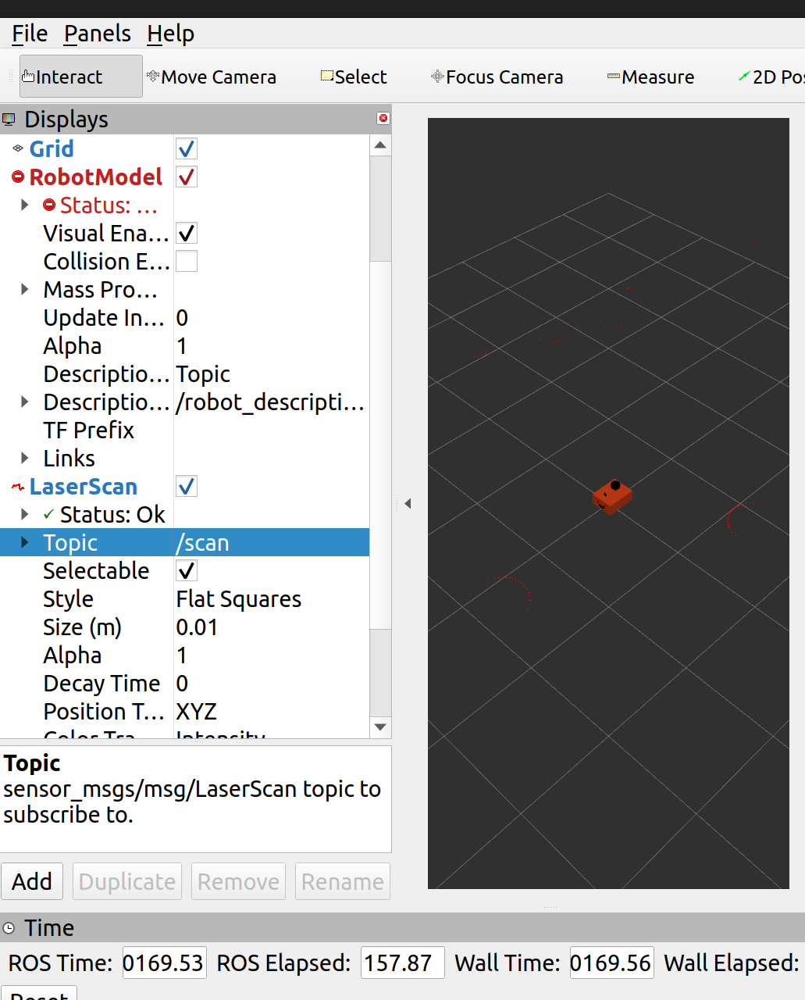

## Robot Package Template

This is a GitHub template. You can make your own copy by clicking the green "Use this template" button.

It is recommended that you keep the repo/package name the same, but if you do change it, ensure you do a "Find all" using your IDE (or the built-in GitHub IDE by hitting the `.` key) and rename all instances of `my_bot` to whatever your project's name is.

Note that each directory currently has at least one file in it to ensure that git tracks the files (and, consequently, that a fresh clone has direcctories present for CMake to find). These example files can be removed if required (and the directories can be removed if `CMakeLists.txt` is adjusted accordingly).

### To launch in gazebo classic

`colcon build --symlink-install`

`. install/setup.bash`

`ros2 launch articubot_one launch_sim.launch.py world:=worlds/obstacles.world`

### To see the lidar visualisation in rviz2

`rviz2`

1. change "Fixed Frame" to "base_link"
2. Add(By DisplayType) -> RobotModel -> Description -> `/robot_description`
3. Add(By DisplayType) -> LaserScan -> Topic -> `/scan`

### Debug

If world not loading, model not loading, etc
* gzserver --verbose worlds/obstacles.world
* gzclient --verbose

### Tutorial

https://www.youtube.com/watch?v=eJZXRncGaGM&t=722s